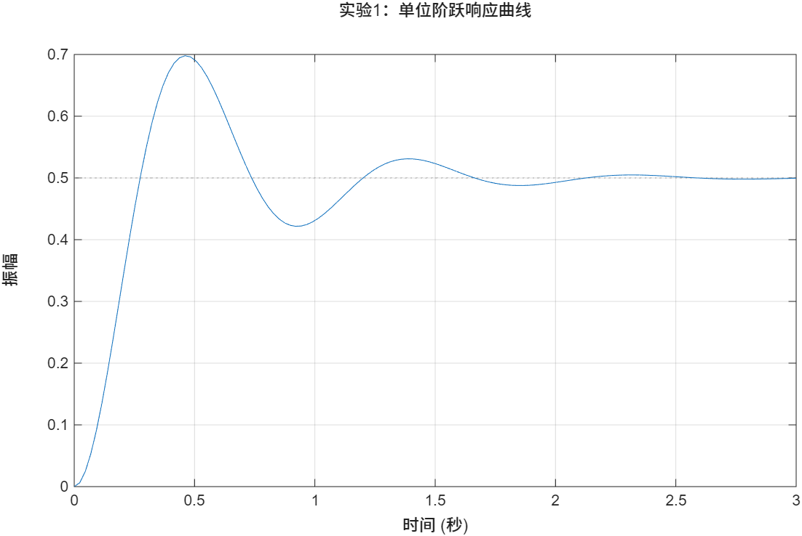
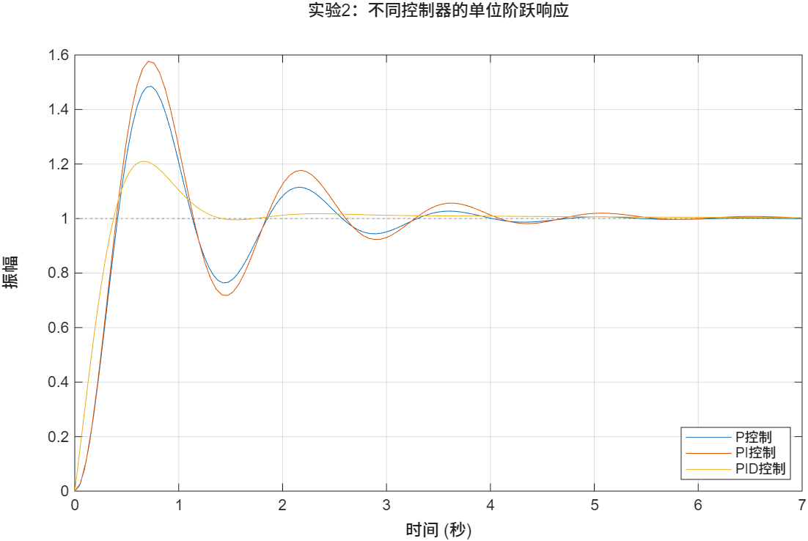

# 实验十：控制系统阶跃响应与 PID 控制器比较

## 1. 实验目的

本实验基于 MATLAB Control System Toolbox，完成典型连续控制系统的建模、闭环反馈构造、阶跃响应分析以及 P、PI、PID 控制器性能比较。

通过本实验可以掌握：

- 使用 `tf` 构造连续传递函数模型；
- 使用 `feedback` 建立单位负反馈闭环系统；
- 使用 `step` 绘制系统单位阶跃响应；
- 使用 `stepinfo` 提取时域性能指标；
- 比较 P、PI、PID 控制器对系统动态性能的影响。

## 2. 实验内容

实验十包含两个 MATLAB 脚本：

| 文件 | 内容 |
| --- | --- |
| `main01.m` | 二阶系统单位负反馈闭环建模与阶跃响应性能指标分析 |
| `main02.m` | 对被控对象分别设计 P、PI、PID 控制器，并比较阶跃响应 |

## 3. 实验一：闭环系统阶跃响应分析

### 3.1 系统模型

脚本 `main01.m` 首先建立开环传递函数：

$$
G(s)=\frac{25}{s^2+4s+25}
$$

随后构造单位负反馈闭环系统：

$$
T(s)=\frac{G(s)}{1+G(s)}
$$

### 3.2 程序流程

`main01.m` 的主要步骤如下：

1. 使用 `tf(num, den)` 建立开环传递函数；
2. 使用 `feedback(G, 1)` 构造单位负反馈闭环系统；
3. 使用 `step(sys_cl)` 绘制闭环系统单位阶跃响应；
4. 使用 `stepinfo(sys_cl)` 获取系统动态性能指标；
5. 输出上升时间、峰值时间、超调量和调节时间。

### 3.3 性能指标

程序输出的主要阶跃响应指标包括：

- `RiseTime`：上升时间；
- `PeakTime`：峰值时间；
- `Overshoot`：超调量；
- `SettlingTime`：调节时间。

运行结果如下：



## 4. 实验二：P、PI、PID 控制器比较

### 4.1 被控对象模型

脚本 `main02.m` 建立被控对象：

$$
G(s)=\frac{1}{s^2+2s}
$$

该对象包含积分环节，适合用于比较不同控制器对系统响应速度、稳态误差和超调特性的影响。

### 4.2 控制器设计

程序分别设计三类控制器：

#### P 控制器

$$
C_P(s)=K_p
$$

其中：

$$
K_p=20
$$

#### PI 控制器

$$
C_{PI}(s)=K_p+\frac{K_i}{s}
$$

其中：

$$
K_p=20,\quad K_i=6
$$

#### PID 控制器

$$
C_{PID}(s)=K_d s+K_p+\frac{K_i}{s}
$$

其中：

$$
K_d=3,\quad K_p=20,\quad K_i=6
$$

### 4.3 响应比较

程序对三种控制器分别构造单位负反馈闭环系统：

$$
T(s)=\frac{C(s)G(s)}{1+C(s)G(s)}
$$

并在同一坐标系中绘制单位阶跃响应曲线，便于直观比较不同控制策略的动态性能。

运行结果如下：



## 5. 文件说明

```text
实验10/
├─ main01.m          # 闭环系统阶跃响应与性能指标分析
├─ main02.m          # P、PI、PID 控制器阶跃响应比较
├─ README.md         # 实验说明文档
└─ res/
   ├─ Figure_1.png   # main01.m 运行结果
   └─ Figure_2.png   # main02.m 运行结果
```

## 6. 使用方法

在 MATLAB 中进入实验目录后运行：

```matlab
cd 实验10
main01
main02
```

也可以分别运行单个脚本：

```matlab
main01
```

或：

```matlab
main02
```

## 7. 关键知识点

### 7.1 传递函数建模

MATLAB 中可通过 `tf` 函数由分子、分母多项式系数直接构造传递函数模型：

```matlab
G = tf(num, den);
```

### 7.2 单位负反馈闭环系统

`feedback(G, 1)` 用于构造单位负反馈闭环系统，是控制系统仿真分析中的常用建模方式。

### 7.3 阶跃响应分析

`step` 用于绘制系统对单位阶跃输入的响应曲线，能够直观反映系统响应速度、稳定性和超调情况。

### 7.4 时域性能指标

`stepinfo` 可以自动计算阶跃响应的典型性能指标，常用于评价控制系统设计效果。

### 7.5 PID 控制器作用

- P 控制主要提高响应速度，但可能产生较大超调或稳态误差；
- PI 控制通过积分环节改善稳态误差；
- PID 控制在 PI 基础上加入微分环节，有助于改善动态响应和抑制超调。

## 8. 实验总结

本实验通过两个典型控制系统仿真实例，完成了闭环系统阶跃响应分析和 P、PI、PID 控制器性能比较。实验进一步加深了对传递函数建模、反馈控制结构、时域性能指标和 PID 控制规律的理解，为后续控制系统设计与仿真分析奠定基础。

## 9. 实验拓展展望

控制理论的发展已经走过了上百年的历程，从最初的机械调速器到如今的智能控制系统，其核心思想始终未变——通过反馈将系统的不确定性转化为可控性。本实验所涉及的 PID 控制，尽管结构简单，却在工业现场占据了统治地位。有人说"PID 是控制界的瑞士军刀"，它之所以历久弥新，正是因为比例、积分、微分三个环节恰好对应了系统的现在、过去和未来：比例关注当前的偏差，积分消除历史的积累误差，微分则预判未来的变化趋势。这种跨越时空的协同，本质上是一种朴素而深刻的控制哲学。

然而，现实世界远比实验室中的二阶系统复杂得多。实际系统中往往存在非线性（如饱和、死区、滞环）、时滞、参数摄动和外部扰动，传统的线性 PID 控制器在面对这些复杂因素时往往力不从心。这就催生了更先进的控制策略——自适应控制能够在线调整控制器参数以应对被控对象的时变特性；鲁棒控制在模型不确定的情况下仍能保证系统的稳定性；模型预测控制则通过在线求解优化问题，显式地处理约束条件，在化工、航空航天等领域大放异彩；而近年来深度强化学习的兴起，更让控制器具备了从数据中自主学习策略的能力，为复杂系统的智能控制打开了新的可能性。

计算机仿真作为连接理论设计与工程实践的桥梁，其价值在于"低成本试错"。在真实物理系统上调试控制参数不仅耗时费力，还可能带来安全风险，而仿真环境允许我们在虚拟空间中对控制器进行充分的验证和优化。随着数字孪生、高保真建模和实时仿真技术的发展，仿真的精度和效率不断提升，其在控制系统设计中的地位也将愈发重要。希望本实验能够成为你探索更广阔控制世界的一个起点，在未来的学习和研究中，不断深入理解控制理论的本质，掌握先进的控制方法，用工程思维去解决实际问题。
