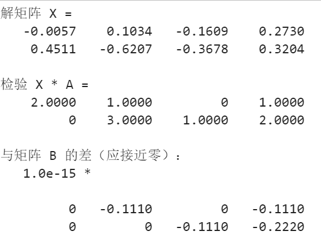
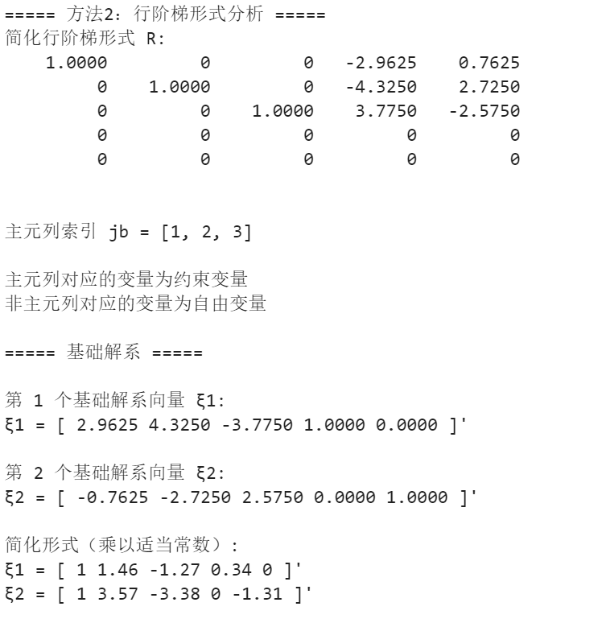
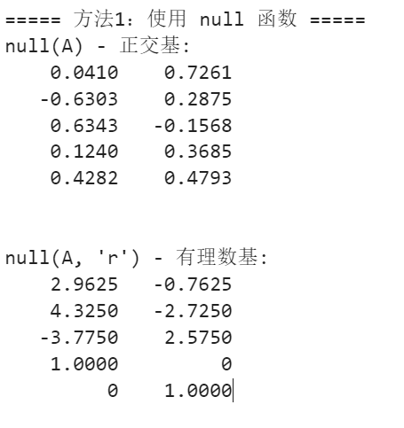
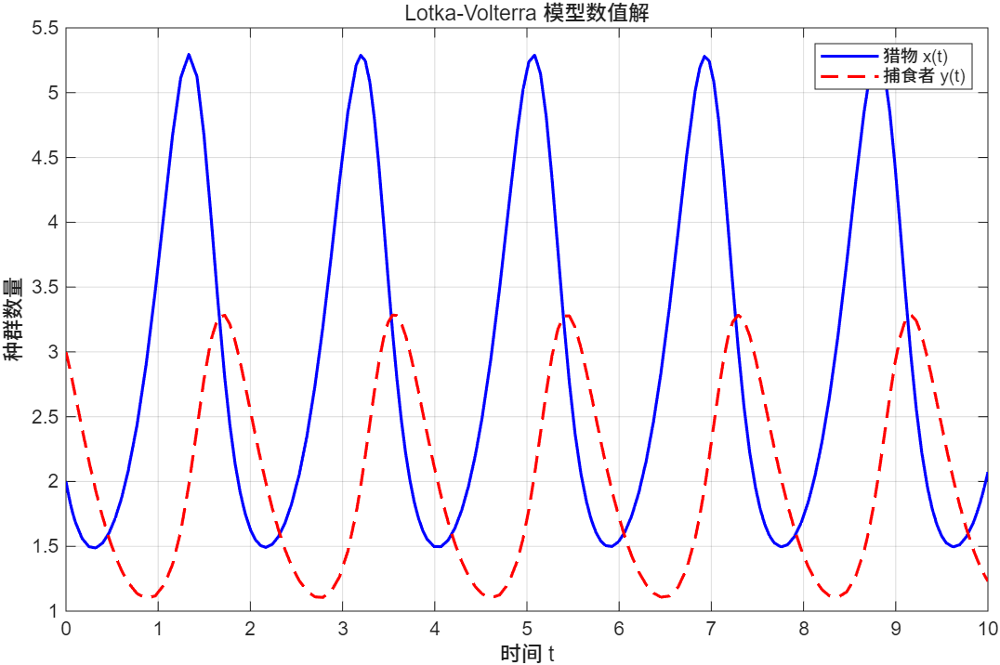
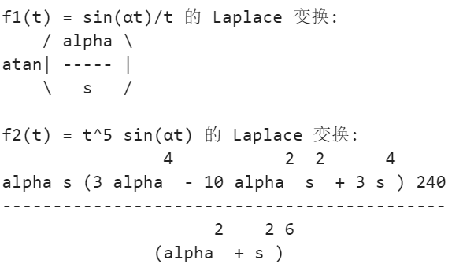

# 实验三：数值计算与符号计算

## 实验目的

1. 掌握 MATLAB 的矩阵方程求解方法
2. 理解齐次线性方程组的基础解系概念及求解方法
3. 学习常微分方程的数值解法
4. 掌握 Laplace 变换的符号计算

## 实验内容

### 1. 矩阵方程求解 (main01.m)

求解矩阵方程 X·A = B 的解矩阵 X。

**源程序：**
```matlab
% 定义矩阵 A 和 B
clc;
A = [7 6 9 7; 7 1 3 2; 2 1 5 5; 6 4 2 6];
B = [2 1 0 1; 0 3 1 2];

% 求解 X，使得 X * A = B
X = B / A;

% 显示解
disp('解矩阵 X =');
disp(X);

% 检验：计算 X * A 并与 B 比较
C = X * A;
disp('检验 X * A =');
disp(C);
disp('与矩阵 B 的差（应接近零）：');
disp(C - B);
```

**运行结果：**



---

### 2. 齐次线性方程组的基础解系 (main02.m)

求解5个未知数的齐次线性方程组，分析解空间并给出基础解系。

**方程组：**
```
6x1 + x2 + 4x3 - 7x4 - 3x5 = 0
-2x1 - 7x2 - 8x3 + 6x4 = 0
-4x1 + 5x2 + x3 - 6x4 + 8x5 = 0
-34x1 + 36x2 + 9x3 - 21x4 + 49x5 = 0
-26x1 - 12x2 - 27x3 + 27x4 + 17x5 = 0
```

**源程序：**
```matlab
clear; clc;

% 1. 定义系数矩阵
A = [6   1   4  -7  -3;
    -2  -7  -8   6   0;
    -4   5   1  -6   8;
   -34  36   9 -21  49;
   -26 -12 -27  27  17];

% 2. 使用 null 函数求解基础解系
Z_rational = null(A, 'r');  % 有理数形式

% 3. 分析解空间
rank_A = rank(A);
dim_null = size(A, 2) - rank_A;

% 4. 使用行阶梯形式分析
[R, jb] = rref(A);

% 5. 输出基础解系
for i = 1:size(Z_rational, 2)
    fprintf('\n第 %d 个基础解系向量 ξ%d:\n', i, i);
    disp(Z_rational(:, i)');
end

% 6. 验证每个基础解系向量
for i = 1:size(Z_rational, 2)
    residual = norm(A * Z_rational(:, i));
    fprintf('A*ξ%d = 0 ? ||A*ξ%d|| = %.2e\n', i, i, residual);
end
```

**运行结果：**





---

### 3. 常微分方程数值解 - Lotka-Volterra 模型 (main03.m)

求解 Lotka-Volterra 捕食者-猎物模型的数值解，分析种群动态变化。

**模型方程：**
```
dx/dt = 4x - 2xy
dy/dt = xy - 3y
```

**源程序：**
```matlab
% 定义微分方程函数
function dxy = lotka_volterra(t, xy)
    x = xy(1);
    y = xy(2);
    dxdt = 4*x - 2*x*y;
    dydt = x*y - 3*y;
    dxy = [dxdt; dydt];
end

% 设置时间区间和初始条件
tspan = [0 10];  % 求解时间范围
xy0 = [2; 3];    % 初始条件 [x(0); y(0)]

% 使用 ode45 求解微分方程
[t, xy] = ode45(@lotka_volterra, tspan, xy0);

% 提取解
x = xy(:, 1);  % 猎物数量
y = xy(:, 2);  % 捕食者数量

% 绘制时域曲线
figure;
plot(t, x, 'b-', 'LineWidth', 1.5); hold on;
plot(t, y, 'r--', 'LineWidth', 1.5);
xlabel('时间 t');
ylabel('种群数量');
legend('猎物 x(t)', '捕食者 y(t)');
title('Lotka-Volterra 模型数值解');
grid on;
```

**运行结果：**



---

### 4. Laplace 变换的符号计算 (main04.m)

使用符号运算工具箱计算两个函数的 Laplace 变换。

**函数：**
- f₁(t) = sin(αt) / t
- f₂(t) = t⁵ sin(αt)

**源程序：**
```matlab
clc;
syms t s alpha real

% 定义函数
f1 = sin(alpha*t) / t;
f2 = t^5 * sin(alpha*t);

% 计算 Laplace 变换
F1 = laplace(f1, t, s);
F2 = laplace(f2, t, s);

% 显示结果
disp('f1(t) = sin(αt)/t 的 Laplace 变换:');
pretty(simplify(F1));

disp('f2(t) = t^5 sin(αt) 的 Laplace 变换:');
pretty(simplify(F2));
```

**运行结果：**



## 文件说明

| 文件名 | 描述 |
|--------|------|
| `main01.m` | 矩阵方程 X·A = B 求解 |
| `main02.m` | 齐次线性方程组基础解系求解 |
| `main03.m` | Lotka-Volterra 模型数值解 |
| `main04.m` | Laplace 变换符号计算 |
| `res/` | 实验结果截图 |
| `实验三-202316034203-徐有才-自动化231.doc` | 实验报告模板 |

## 使用方法

在 MATLAB 中依次运行：
```matlab
main01   % 矩阵方程求解
main02   % 齐次线性方程组基础解系
main03   % Lotka-Volterra 模型
main04   % Laplace 变换
```

## 关键知识点

1. **矩阵方程求解**: 使用 `B / A` 右除运算求解 X·A = B
2. **基础解系**: `null(A, 'r')` 函数返回有理数形式的基础解系
3. **矩阵秩与解空间**: `rank(A)` 与 `null(A)` 的关系：dim(Null(A)) = n - rank(A)
4. **行阶梯形式**: `rref(A)` 用于分析主元列和自由变量
5. **微分方程数值解**: `ode45` 函数求解常微分方程初值问题
6. **符号计算**: `syms` 声明符号变量，`laplace` 计算拉普拉斯变换
7. **函数定义**: 使用 `function` 定义微分方程右端函数供 ODE 求解器调用

## 实验要点

- **main01**: 矩阵右除 `B/A` 等价于 `B * inv(A)`，但数值稳定性更好
- **main02**: 理解基础解系的含义和通解表示：X = c₁ξ₁ + c₂ξ₂ + ... + cₖξₖ
- **main03**: ODE 求解器需要先定义函数句柄，再传递给求解器
- **main04**: Laplace 变换的符号计算需先声明符号变量，使用 `pretty()` 美化输出
