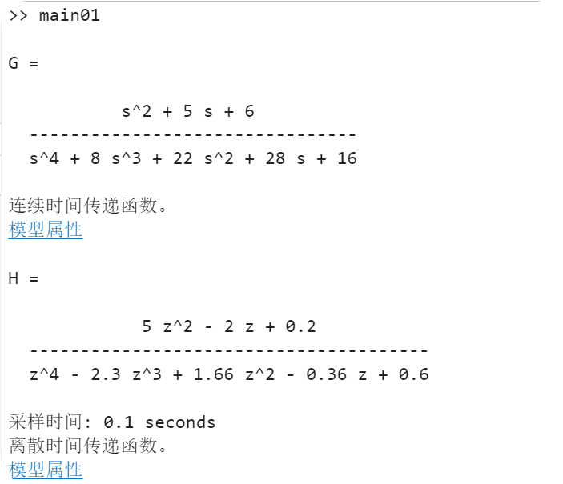
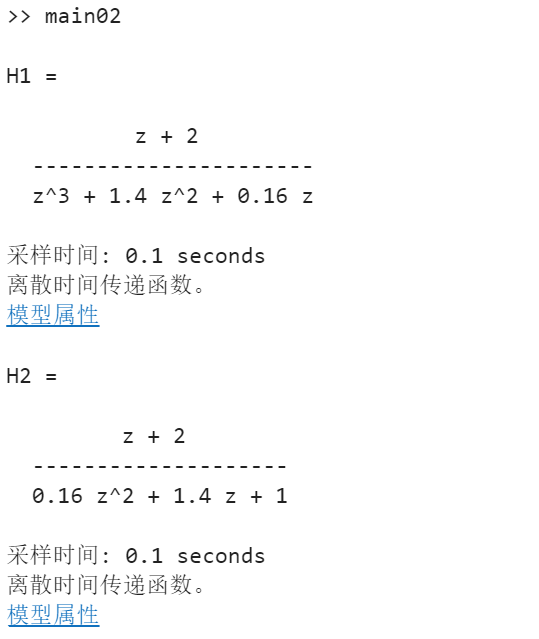
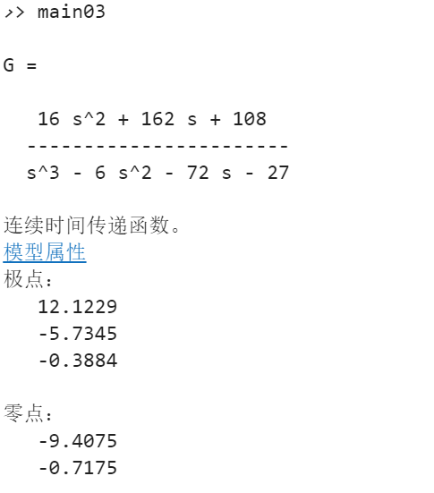
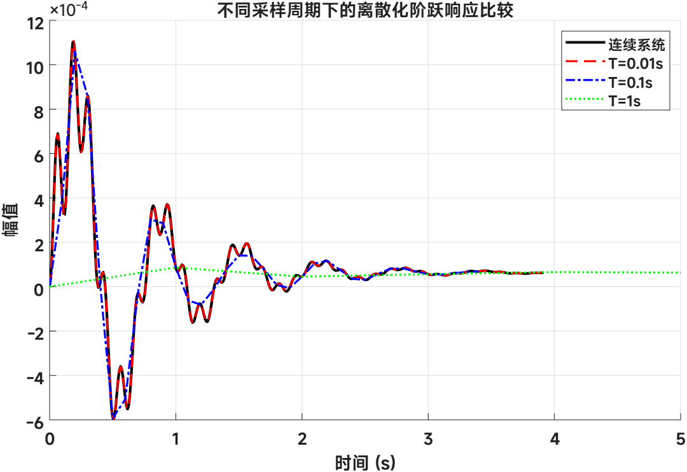

# 实验四：控制系统建模与离散化分析

## 实验目的

1. 掌握 MATLAB 中传递函数模型的建立方法
2. 理解连续系统与离散系统传递函数的表示形式
3. 学习由差分方程建立离散传递函数模型
4. 掌握状态空间模型到传递函数模型的转换
5. 分析不同采样周期对离散化系统响应的影响

## 实验内容

### 1. 连续/离散传递函数构造 (main01.m)

通过多项式卷积构造连续系统传递函数，并建立指定采样时间的离散传递函数。

**源程序：**
```matlab
%% 问题 1
num1 = [1 5 6];
den1 = conv(conv([1 2 2], [1 2]), [1 4]); % 分母多项式相乘
G = tf(num1, den1)

%% 问题 2
% 先展开分母多项式: z(z-0.4)(z-1)(z-0.9) + 0.6
den_z = conv(conv(conv([1 0], [1 -0.4]), [1 -1]), [1 -0.9]);
den_z(end) = den_z(end) + 0.6; % 加上常数项 0.6
num_z = 5 * conv([1 -0.2], [1 -0.2]); % 分子 5*(z-0.2)^2
H = tf(num_z, den_z, 0.1) % 指定采样时间 T=0.1s
```

**运行结果：**



---

### 2. 差分方程到离散传递函数 (main02.m)

根据差分方程的 Z 变换关系，建立离散系统传递函数模型。

**源程序：**
```matlab
%% 问题 1
% 转换为 Z 变换：z^2 Y + 1.4z Y + 0.16 Y = z^-1 U + 2z^-2 U
% Y/U = (z^-1 + 2z^-2) / (z^2 + 1.4z + 0.16) = (z + 2) / (z^3 + 1.4z^2 + 0.16z)
num1 = [1 2];
den1 = [1 1.4 0.16 0];
H1 = tf(num1, den1, 0.1)

%% 问题 2
% 转换为 Z 变换：z^-2 Y + 1.4z^-1 Y + 0.16 Y = z^-1 U + 2z^-2 U
% Y/U = (z^-1 + 2z^-2) / (z^-2 + 1.4z^-1 + 0.16) = (z + 2) / (1 + 1.4z + 0.16z^2)
num2 = [1 2];
den2 = [0.16 1.4 1];
H2 = tf(num2, den2, 0.1)
```

**运行结果：**



---

### 3. 状态空间模型转换与零极点分析 (main03.m)

建立状态空间模型，将其转换为传递函数，并求解系统零点和极点。

**源程序：**
```matlab
A = [1 2 3; 4 5 6; 7 8 0];
B = [4; 3; 2];
C = [1 2 3];
D = 0;

% 建立状态空间模型
sys_ss = ss(A, B, C, D);

% 转换为传递函数
[num, den] = ss2tf(A, B, C, D);
G = tf(num, den)

% 求零极点
[p, z] = pzmap(G);
disp('极点：'); disp(p);
disp('零点：'); disp(z);
```

**运行结果：**



---

### 4. 不同采样周期下的离散化阶跃响应比较 (main04.m)

构造连续传递函数，使用零阶保持器方法进行离散化，并比较不同采样周期下的阶跃响应。

**源程序：**
```matlab
s = tf('s');
G_s = ((s+1)^2 * (s^2 + 2*s + 400)) / ((s+5)^2 * (s^2 + 3*s + 100) * (s^2 + 3*s + 2500));

Ts_list = [0.01, 0.1, 1];
figure; hold on;

% 设置全局字体为 MiSans
set(0, 'DefaultAxesFontName', 'MiSans');
set(0, 'DefaultTextFontName', 'MiSans');
set(0, 'DefaultAxesFontSize', 12);
set(0, 'DefaultTextFontSize', 12);

% 绘制连续系统阶跃响应
[y_c, t_c] = step(G_s);
plot(t_c, y_c, 'k', 'LineWidth', 2);

% 循环离散化并绘图
colors = {'r--', 'b-.', 'g:'};
for i = 1:length(Ts_list)
    Ts = Ts_list(i);
    G_z = c2d(G_s, Ts, 'zoh');
    [y_d, t_d] = step(G_z);
    plot(t_d, y_d, colors{i}, 'LineWidth', 1.5);
end

legend('连续系统', 'T=0.01s', 'T=0.1s', 'T=1s');
title('不同采样周期下的离散化阶跃响应比较');
xlabel('时间 (s)');
ylabel('幅值');
xlim([0 5]);
grid on;
hold off;
```

**运行结果：**



## 文件说明

| 文件 | 描述 |
|---|---|
| `main01.m` | 连续/离散传递函数构造 |
| `main02.m` | 差分方程到离散传递函数转换 |
| `main03.m` | 状态空间到传递函数、零极点分析 |
| `main04.m` | 连续系统离散化及阶跃响应比较 |
| `res/` | 实验结果截图 |
| `实验四-202316034203-徐有才-自动化231.doc` | 实验报告文档 |

## 使用方法

在 MATLAB 中进入 `实验四` 目录后运行：
```matlab
main01   % 连续/离散传递函数构造
main02   % 差分方程传递函数转换
main03   % 状态空间转换与零极点分析
main04   % 不同采样周期阶跃响应比较
```

## 关键知识点

1. **传递函数模型**: 使用 `tf(num, den)` 建立连续系统传递函数
2. **离散传递函数**: 使用 `tf(num, den, Ts)` 指定采样周期建立离散模型
3. **多项式卷积**: 使用 `conv` 展开多个多项式相乘
4. **状态空间模型**: 使用 `ss(A, B, C, D)` 建立状态空间系统
5. **模型转换**: 使用 `ss2tf` 将状态空间模型转换为传递函数
6. **零极点分析**: 使用 `pzmap` 获取系统零点与极点
7. **连续系统离散化**: 使用 `c2d(G_s, Ts, 'zoh')` 进行零阶保持离散化
8. **阶跃响应比较**: 使用 `step` 分析连续系统与离散系统响应差异

## 实验要点

- 采样周期越小，离散系统响应越接近连续系统响应。
- 采样周期过大时，离散系统可能出现明显失真。
- `tf`、`ss`、`ss2tf`、`c2d` 是控制系统建模与分析中的常用函数。
- 传递函数分子、分母系数应按降幂排列。
