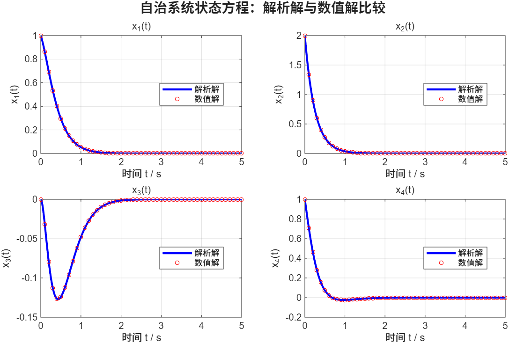
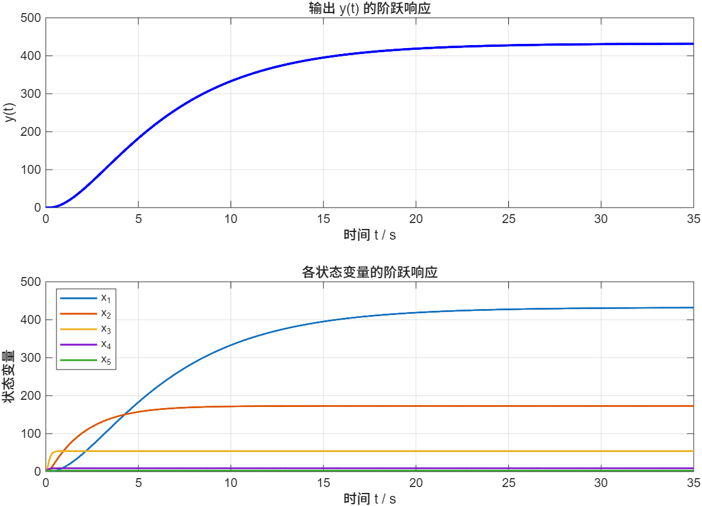
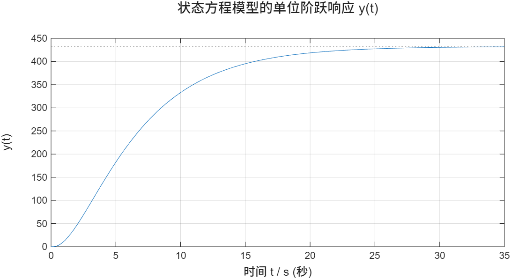
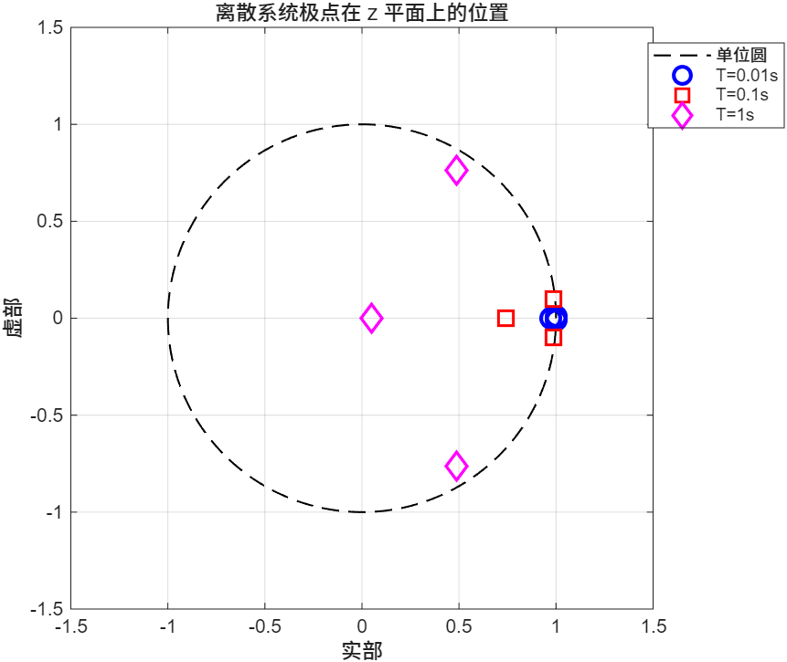
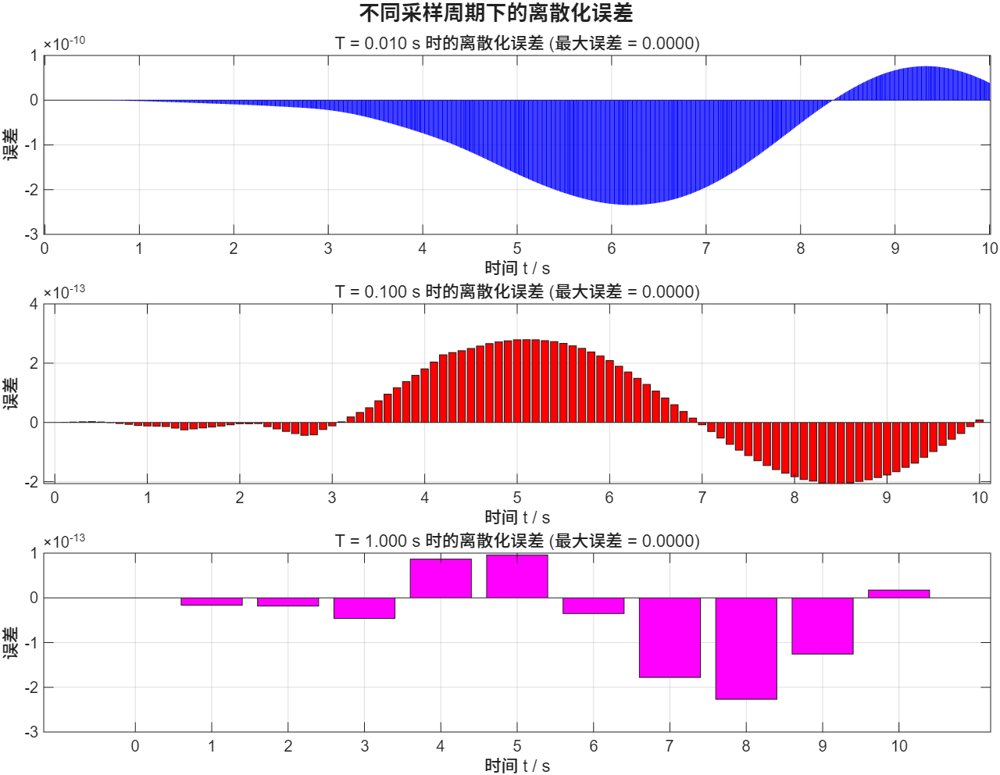
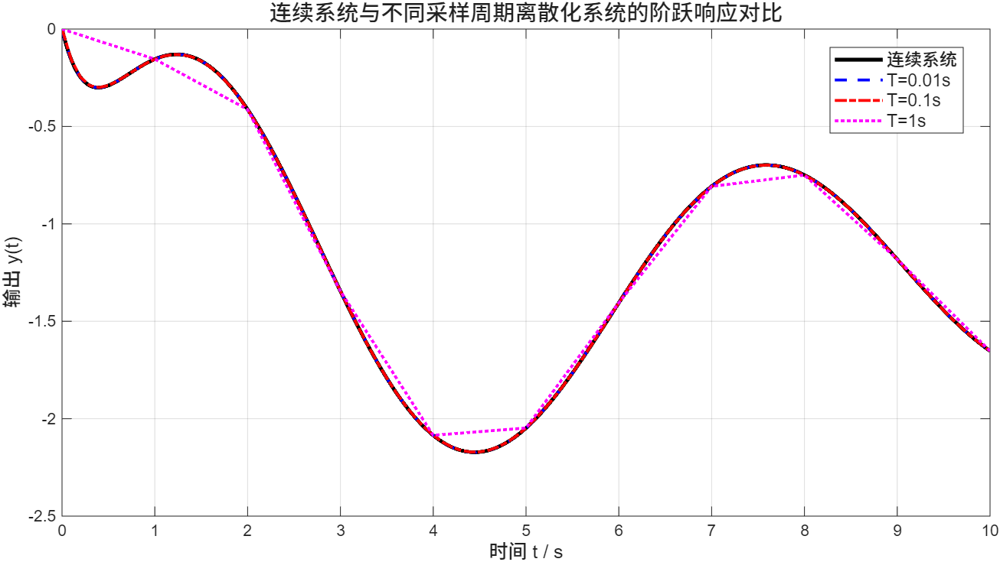

# 实验五：状态空间分析与离散化

## 实验目的

1. 掌握自治系统状态方程的解析解与数值解求解方法
2. 理解状态空间模型的单位阶跃响应分析
3. 掌握连续系统在不同采样周期下的离散化方法
4. 学习离散化误差分析及极点位置对比

## 实验内容

### 1. 自治系统状态方程解析解与数值解比较 (main01.m)

求解自治系统 dx/dt = A·x 的解析解（矩阵指数）和数值解（ode45），并比较两者差异。

**源程序：**
```matlab
%% 定义系统矩阵和初始条件
A = [-5  2  0  0;
      0 -4  0  0;
     -3  2 -4 -1;
     -3  2  0 -4];

x0 = [1; 2; 0; 1];

%% 方法一：解析解 x(t) = expm(A*t) * x0
t_span = 0:0.01:5;

x_exact = zeros(4, length(t_span));
for i = 1:length(t_span)
    x_exact(:, i) = expm(A * t_span(i)) * x0;
end

%% 方法二：数值解（ode45 求解）
[t_num, x_num] = ode45(@(t, x) A * x, t_span, x0);

%% 绘图比较
figure('Name', '解析解 vs 数值解', 'Position', [100 100 900 700]);

titles = {'x_1(t)', 'x_2(t)', 'x_3(t)', 'x_4(t)'};

for i = 1:4
    subplot(2, 2, i);
    plot(t_span, x_exact(i, :), 'b-', 'LineWidth', 2); hold on;
    plot(t_num, x_num(:, i), 'ro', 'MarkerSize', 4, 'MarkerIndices', 1:10:length(t_num));
    xlabel('时间 t / s');
    ylabel(titles{i});
    title(titles{i});
    legend('解析解', '数值解', 'Location', 'best');
    grid on;
end

sgtitle('自治系统状态方程：解析解与数值解比较', 'FontSize', 14, 'FontWeight', 'bold');

%% 打印误差信息
fprintf('解析解与数值解的最大绝对误差:\n');
for i = 1:4
    err = max(abs(x_exact(i, :) - interp1(t_num, x_num(:, i), t_span)));
    fprintf('  x_%d: %.2e\n', i, err);
end
```

**运行结果：**



---

### 2. 状态方程模型的单位阶跃响应 (main02.m)

建立5阶状态空间模型，分析系统的单位阶跃响应及各个状态变量的动态变化。

**源程序：**
```matlab
%% 定义系统矩阵
A = [-0.2   0.5    0      0     0;
      0    -0.5   1.6     0     0;
      0     0    -14.3   85.8   0;
      0     0     0     -33.3  100;
      0     0     0      0    -10];

B = [0; 0; 0; 0; 30];
C = [1, 0, 0, 0, 0];
D = 0;

%% 建立状态空间模型
sys = ss(A, B, C, D);

%% 绘制输出 y(t) 的单位阶跃响应
figure('Name', '输出阶跃响应', 'Position', [100 100 800 400]);
step(sys, 35);
title('状态方程模型的单位阶跃响应 y(t)', 'FontSize', 14);
xlabel('时间 t / s', 'FontSize', 12);
ylabel('y(t)', 'FontSize', 12);
grid on;

%% 查看各状态变量的阶跃响应
figure('Name', '各状态变量阶跃响应', 'Position', [100 100 900 600]);

t = 0:0.01:35;
[y_step, t_step, x_step] = step(sys, t);

subplot(2,1,1);
plot(t_step, y_step, 'b-', 'LineWidth', 2);
xlabel('时间 t / s'); ylabel('y(t)');
title('输出 y(t) 的阶跃响应');
grid on;

subplot(2,1,2);
x_2d = squeeze(x_step);
for i = 1:5
    plot(t_step, x_2d(:, i), 'LineWidth', 1.5); hold on;
end
xlabel('时间 t / s'); ylabel('状态变量');
title('各状态变量的阶跃响应');
legend('x_1', 'x_2', 'x_3', 'x_4', 'x_5', 'Location', 'best');
grid on;
```

**运行结果：**





---

### 3. 连续传递函数在不同采样周期下的离散化及响应比较 (main03.m)

对连续传递函数 G(s) 在不同采样周期下进行 ZOH 离散化，比较阶跃响应、分析误差，并绘制 z 平面极点分布。

**源程序：**
```matlab
%% 定义连续系统传递函数
num = [-2, 3, -4];
den = [1, 3.2, 1.61, 3.03];
Gc = tf(num, den);

%% 检查连续系统稳定性
poles_c = pole(Gc);
fprintf('连续系统极点:\n');
disp(poles_c);

%% 定义不同的采样周期
T_values = [0.01, 0.1, 1];

%% 图1：不同采样周期离散化后的阶跃响应对比
figure('Name', '离散化阶跃响应比较', 'Position', [50 50 1000 500]);

% 连续系统阶跃响应作为参考
t_cont = 0:0.001:10;
y_cont = step(Gc, t_cont);
plot(t_cont, y_cont, 'k-', 'LineWidth', 2.5); hold on;

plot_colors = {'b', 'r', 'm'};
plot_styles = {'--', '-.', ':'};

for k = 1:length(T_values)
    T = T_values(k);
    Gd = c2d(Gc, T, 'zoh');
    [y_d, t_d] = step(Gd, 10);
    plot(t_d, y_d, 'Color', plot_colors{k}, ...
         'LineStyle', plot_styles{k}, 'LineWidth', 1.8);
end

xlabel('时间 t / s', 'FontSize', 12);
ylabel('输出 y(t)', 'FontSize', 12);
title('连续系统与不同采样周期离散化系统的阶跃响应对比', 'FontSize', 14);
legend({'连续系统', 'T=0.01s', 'T=0.1s', 'T=1s'}, ...
       'Location', 'best', 'FontSize', 11);
grid on;

%% 图2：不同采样周期的误差分析
figure('Name', '离散化误差分析', 'Position', [50 50 1000 700]);

for k = 1:length(T_values)
    T = T_values(k);
    Gd = c2d(Gc, T, 'zoh');
    [y_d, t_d] = step(Gd, 10);
    y_d_interp = interp1(t_cont, y_cont, t_d);
    err_vals = y_d(:) - y_d_interp(:);

    subplot(length(T_values), 1, k);
    bar(t_d, err_vals, plot_colors{k});
    xlabel('时间 t / s');
    ylabel('误差');
    title(sprintf('T = %.3f s 时的离散化误差 (最大误差 = %.4f)', T, max(abs(err_vals))));
    grid on;
end
sgtitle('不同采样周期下的离散化误差', 'FontSize', 13, 'FontWeight', 'bold');

%% 图3：极点位置对比（z平面）
figure('Name', 'z平面极点对比', 'Position', [50 50 800 500]);

theta = 0:0.01:2*pi;
plot(cos(theta), sin(theta), 'k--', 'LineWidth', 1); hold on;

markers = {'o', 's', 'd'};
for k = 1:length(T_values)
    T = T_values(k);
    Gd = c2d(Gc, T, 'zoh');
    p = pole(Gd);
    plot(real(p), imag(p), markers{k}, 'Color', plot_colors{k}, ...
         'MarkerSize', 10, 'LineWidth', 2);
end

xlabel('实部'); ylabel('虚部');
title('离散系统极点在 z 平面上的位置');
legend({'单位圆', 'T=0.01s', 'T=0.1s', 'T=1s'}, 'Location', 'best');
axis equal; grid on;
xlim([-1.5 1.5]); ylim([-1.5 1.5]);
```

**运行结果：**







## 文件说明

| 文件 | 描述 |
|---|---|
| `main01.m` | 自治系统状态方程解析解与数值解比较 |
| `main02.m` | 5阶状态空间模型单位阶跃响应分析 |
| `main03.m` | 连续传递函数离散化及响应比较 |
| `res/` | 实验结果截图 |
| `实验五-202316034203-徐有才-自动化231.doc` | 实验报告文档 |

## 使用方法

在 MATLAB 中进入 `实验五` 目录后运行：
```matlab
main01   % 自治系统解析解与数值解比较
main02   % 状态空间模型阶跃响应
main03   % 连续系统离散化分析
```

## 关键知识点

1. **矩阵指数**: 使用 `expm(A*t)` 计算自治系统状态方程的解析解
2. **ODE 数值求解**: 使用 `ode45` 求解常微分方程初值问题
3. **状态空间模型**: 使用 `ss(A, B, C, D)` 建立系统模型
4. **阶跃响应**: 使用 `step` 分析系统的单位阶跃响应特性
5. **连续系统离散化**: 使用 `c2d(Gc, T, 'zoh')` 进行零阶保持离散化
6. **离散化误差分析**: 比较不同采样周期下的响应误差
7. **极点分析**: 通过 `pole` 获取系统极点，判断稳定性
8. **z 平面分析**: 离散系统极点必须在单位圆内才能保持稳定

## 实验结论

1. 解析解（矩阵指数法）与数值解（ode45）高度吻合，误差极小。
2. 采样周期越小（如 T=0.01s），离散系统响应越接近连续系统。
3. 采样周期越大（如 T=1s），离散化带来的误差越大，响应失真越明显。
4. 所有离散化后的极点均在单位圆内，系统保持稳定。
5. 采样周期的选择应在系统带宽与计算负担之间取得平衡。