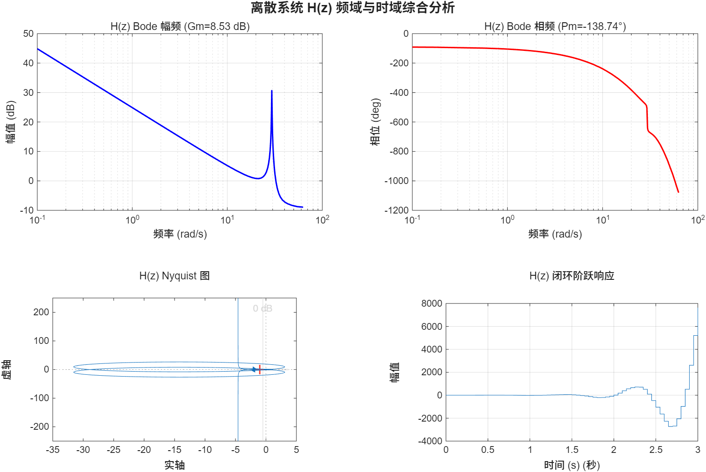

# 实验六：根轨迹与频域分析

## 实验目的

1. 掌握状态空间模型到传递函数的转换及根轨迹分析方法
2. 理解参数根轨迹的构造方法，学会将特征方程改写为等效形式
3. 掌握带纯延迟系统的频域分析方法（Bode 图、Nyquist 图）
4. 学习增益裕度与相位裕度的计算及稳定性判定
5. 理解 Pade 近似在延迟环节处理中的应用

## 实验内容

### 1. 状态方程系统根轨迹与稳定性分析 (main01.m)

给定 4 阶状态空间矩阵，转换为传递函数，绘制根轨迹图，数值搜索使闭环系统稳定的增益 K 范围，并选取稳定 K 值验证闭环阶跃响应。

**源程序：**
```matlab
%% 状态方程系统根轨迹与稳定性分析
clc; clear; close all;

% 定义状态空间矩阵
A = [-1.5, -13.5, -13, 0;
      10,    0,     0,  0;
      0,     1,     0,  0;
      0,     0,     1,  0];
B = [1; 0; 0; 0];
C = [0, 0, 0, 1];
D = 0;

% 转为传递函数
sys_ss = ss(A, B, C, D);
sys_tf = tf(sys_ss);

fprintf('开环传递函数 G(s):\n');
sys_tf

% 绘制根轨迹
figure(1);
rlocus(sys_tf);
title('实验一: 状态方程系统根轨迹');
xlabel('实部'); ylabel('虚部');
grid on;
set(gcf, 'Position', [100 100 800 600]);
drawnow;

% 求稳定的 K 范围
[num, den] = tfdata(sys_tf, 'v');

stable_K = [];
for K = 0:0.005:500
    poles = roots(den + K * num);
    if all(real(poles) < 0)
        stable_K = [stable_K, K];
    end
end

if ~isempty(stable_K)
    fprintf('\n====================================\n');
    fprintf('使得闭环系统稳定的 K 值范围: [%.4f, %.4f)\n', ...
            min(stable_K), max(stable_K));
    fprintf('====================================\n');
end

% 验证: 阶跃响应
K_opt = 50;
T_cl = feedback(K_opt * sys_tf, 1);

figure(2);
step(T_cl, 5);
title(sprintf('实验一: K = %d 时闭环阶跃响应', K_opt));
xlabel('时间 (s)'); ylabel('幅值');
grid on;
set(gcf, 'Position', [100 100 800 600]);
drawnow;
```

**运行结果：**

```
实验一开环传递函数 G(s):

sys_tf =

                10
  -------------------------------
  s^4 + 1.5 s^3 + 135 s^2 + 130 s

连续时间传递函数。

====================================
使得闭环系统稳定的 K 值范围: [0.0050, 418.8850)
====================================
```


---

### 2. 关于参数 a 的根轨迹 (main02.m)

开环传递函数含可变参数 a，将闭环特征方程改写为 `P(s) + a·Q(s) = 0` 形式，构造等效传递函数 `G_eq = Q/P`，绘制关于 a 的根轨迹，数值搜索稳定区间，并用不同 a 值的阶跃响应验证。

**源程序：**
```matlab
%% 关于参数 a 的根轨迹
% 开环传递函数：
%                0.3 (s+2)(s^2 + 2.1s + 2.23)
%   G(s) = --------------------------------------
%            s^2 (s^2 + 3s + 4.32) (s + a)
%
% 闭环特征方程改写为: P(s) + a*Q(s) = 0, 即 1 + a*Q(s)/P(s) = 0

clear; clc; close all;

%% 1. 构造 P(s) 和 Q(s)
P_part1 = conv(conv([1 0 0], [1 3 4.32]), [1 0]);   % s^3(s^2+3s+4.32)
P_part2 = 0.3 * conv([1 2], [1 2.1 2.23]);           % 0.3(s+2)(s^2+2.1s+2.23)

% 对齐相加
L = max(length(P_part1), length(P_part2));
P = [zeros(1, L-length(P_part1)) P_part1] + ...
    [zeros(1, L-length(P_part2)) P_part2];

Q = conv([1 0 0], [1 3 4.32]);    % s^2(s^2+3s+4.32)

fprintf('P(s) 系数: '); disp(P);
fprintf('Q(s) 系数: '); disp(Q);

%% 2. 等效传递函数 G_eq = Q/P, rlocus 绘制关于 a 的根轨迹
G_eq = tf(Q, P);

fprintf('等效传递函数 G_eq(s) = Q(s)/P(s):\n');
G_eq

figure('Name','实验二 关于a的根轨迹','Color','w');
rlocus(G_eq);
grid on;
title('G(s) 关于参数 a 的根轨迹');
xlabel('实轴'); ylabel('虚轴');

%% 3. 数值搜索稳定区间
a_vec = 0:0.01:30;
stab_flag = false(size(a_vec));

for i = 1:length(a_vec)
    a = a_vec(i);
    den_full = conv(conv([1 0 0], [1 3 4.32]), [1 a]);
    num_full = 0.3 * conv([1 2], [1 2.1 2.23]);

    L = max(length(den_full), length(num_full));
    d_pad = [zeros(1, L-length(den_full)) den_full];
    n_pad = [zeros(1, L-length(num_full)) num_full];
    char_poly = d_pad + n_pad;

    r = roots(char_poly);
    stab_flag(i) = all(real(r) < 0);
end

% 找出稳定区间边界
idx = find(stab_flag);
if isempty(idx)
    fprintf('在搜索范围内未找到稳定区间。\n');
else
    da      = diff(idx);
    gap_pos = find(da > 1);
    if isempty(gap_pos)
        starts = idx(1);
        ends   = idx(end);
    else
        starts = [idx(1),        idx(gap_pos + 1)];
        ends   = [idx(gap_pos),  idx(end)];
    end
    fprintf('\n使闭环系统稳定的 a 值范围：\n');
    for k = 1:length(starts)
        fprintf('   %.3f  <=  a  <=  %.3f\n', ...
                a_vec(starts(k)), a_vec(ends(k)));
    end
end

%% 4. 不同 a 值验证
a_test = [0.5, 1.26, 2, 5];
figure('Name','实验二 不同a下阶跃响应','Color','w');
for i = 1:length(a_test)
    a = a_test(i);
    den_full = conv(conv([1 0 0], [1 3 4.32]), [1 a]);
    num_full = 0.3 * conv([1 2], [1 2.1 2.23]);
    G_ol = tf(num_full, den_full);
    sys_cl = feedback(G_ol, 1);

    subplot(2,2,i);
    p = pole(sys_cl);
    if all(real(p) < 0)
        step(sys_cl, 20);
        title(sprintf('a = %.2f (稳定)', a));
    else
        t = 0:0.01:3;
        [y, t_out] = impulse(sys_cl, t);
        plot(t_out, y);
        ylim([-10 10]);
        title(sprintf('a = %.2f (不稳定)', a));
    end
    grid on;
end
sgtitle('不同 a 值的闭环阶跃响应');
```

**运行结果：**

```
等效传递函数 G_eq(s) = Q(s)/P(s):

G_eq =

                s^4 + 3 s^3 + 4.32 s^2
  ---------------------------------------------------
  s^5 + 3 s^4 + 4.62 s^3 + 1.23 s^2 + 1.929 s + 1.338

连续时间传递函数。

使闭环系统稳定的 a 值范围：
   1.260  <=  a  <=  30.000
```

程序绘制关于参数 a 的根轨迹图及不同 a 值下的闭环阶跃响应对比。

---

### 3. 带延迟系统的频域分析 (main03.m)

对含纯延迟环节的连续系统和离散系统进行频域分析：计算增益裕度、相位裕度，绘制 Bode 图与 Nyquist 图，判定闭环稳定性并验证阶跃响应。

**源程序：**
```matlab
%% 带延迟系统的频域分析
clc; clear; close all;

%% 第1部分: 连续系统 G(s)
fprintf('========== 第1部分: 连续系统 G(s) ==========\n');

s = tf('s');

% 开环传递函数 (不含延迟)
G_num = (-2*s + 1);
G_den = s^2 * (s^2 + 3*s + 3) * (s + 5) * (s^2 + 2*s + 6);
G_rat = G_num / G_den;

% 加入延迟 e^{-3s}
tau = 3;
G_pade  = pade(G_rat * exp(-tau*s), 10);  % 10阶Pade近似
G_exact = G_rat * exp(-tau*s);

% 计算裕度
[Gm, Pm, Wcg, Wcp] = margin(G_exact);
fprintf('增益裕度 Gm: %.4f (倍) = %.4f dB\n', Gm, 20*log10(Gm));
fprintf('相位裕度 Pm: %.4f deg\n', Pm);
fprintf('穿越频率 Wcg: %.4f rad/s\n', Wcg);
fprintf('剪切频率 Wcp: %.4f rad/s\n', Wcp);

% 闭环稳定性判定
T_cl_G = feedback(G_pade, 1);
poles_G = pole(T_cl_G);
is_stable_G = all(real(poles_G) < 0);

fprintf('\n闭环极点实部:\n');
disp(sort(real(poles_G), 'descend')');

if is_stable_G
    fprintf('判定: 闭环系统 G(s) 是稳定的\n');
else
    fprintf('判定: 闭环系统 G(s) 是不稳定的\n');
end

% Bode 幅频与相频
[mag_G, phase_G, w_G] = bode(G_exact);
mag_G   = squeeze(mag_G);
phase_G = squeeze(phase_G);

figure('Name', '连续系统 G(s) 分析', 'Position', [50 50 1200 750]);

subplot(2,2,1);
semilogx(w_G, 20*log10(mag_G), 'b', 'LineWidth', 1.5);
xlabel('频率 (rad/s)'); ylabel('幅值 (dB)');
title(sprintf('G(s) Bode 幅频 (Gm=%.2f dB)', 20*log10(Gm)));
grid on;

subplot(2,2,2);
semilogx(w_G, phase_G, 'r', 'LineWidth', 1.5);
xlabel('频率 (rad/s)'); ylabel('相位 (deg)');
title(sprintf('G(s) Bode 相频 (Pm=%.2f°)', Pm));
grid on;

subplot(2,2,3);
nyquist(G_exact);
title('G(s) Nyquist 图');
grid on;

subplot(2,2,4);
step(T_cl_G, 20);
title('G(s) 闭环阶跃响应 (Pade近似)');
xlabel('时间 (s)'); ylabel('幅值');
grid on;

sgtitle('连续系统 G(s) 频域与时域综合分析', 'FontSize', 14, 'FontWeight', 'bold');
drawnow;

%% 第2部分: 离散系统 H(z)
fprintf('\n========== 第2部分: 离散系统 H(z) ==========\n');

T_sample = 0.05;

% 定义离散传递函数 (不含延迟)
H_num_z = [1, 0, 0.568];
H_den_z = conv([1, -1], [1, -0.2, 0.99]);
H_rat_z = tf(H_num_z, H_den_z, T_sample);

% 离散延迟 z^{-5}
H_delay = tf([1], [1, 0, 0, 0, 0, 0], T_sample);
H_z = H_rat_z * H_delay;

fprintf('离散开环传递函数 H(z):\n');
H_z

[Gm_d, Pm_d, Wcg_d, Wcp_d] = margin(H_z);
fprintf('增益裕度 Gm: %.4f (倍) = %.4f dB\n', Gm_d, 20*log10(Gm_d));
fprintf('相位裕度 Pm: %.4f deg\n', Pm_d);

% 离散闭环稳定性判定
T_cl_H = feedback(H_z, 1);
poles_H = pole(T_cl_H);
is_stable_H = all(abs(poles_H) < 1);

fprintf('\n闭环极点模值:\n');
disp(sort(abs(poles_H), 'descend')');

if is_stable_H
    fprintf('判定: 离散闭环系统 H(z) 是稳定的\n');
else
    fprintf('判定: 离散闭环系统 H(z) 是不稳定的\n');
end

[mag_H, phase_H, w_H] = bode(H_z);
mag_H   = squeeze(mag_H);
phase_H = squeeze(phase_H);

figure('Name', '离散系统 H(z) 分析', 'Position', [100 100 1200 750]);

subplot(2,2,1);
semilogx(w_H, 20*log10(mag_H), 'b', 'LineWidth', 1.5);
xlabel('频率 (rad/s)'); ylabel('幅值 (dB)');
title(sprintf('H(z) Bode 幅频 (Gm=%.2f dB)', 20*log10(Gm_d)));
grid on;

subplot(2,2,2);
semilogx(w_H, phase_H, 'r', 'LineWidth', 1.5);
xlabel('频率 (rad/s)'); ylabel('相位 (deg)');
title(sprintf('H(z) Bode 相频 (Pm=%.2f°)', Pm_d));
grid on;

subplot(2,2,3);
nyquist(H_z);
title('H(z) Nyquist 图');
grid on;

subplot(2,2,4);
step(T_cl_H, 3);
title('H(z) 闭环阶跃响应');
xlabel('时间 (s)'); ylabel('幅值');
grid on;

sgtitle('离散系统 H(z) 频域与时域综合分析', 'FontSize', 14, 'FontWeight', 'bold');
drawnow;

fprintf('\n========== 全部完成 ==========\n');
```

**运行结果：**

```
========== 第1部分: 连续系统 G(s) ==========
增益裕度 Gm: 52.3146 (倍) = 34.3725 dB
相位裕度 Pm: -39.7043 deg
穿越频率 Wcg: 1.1238 rad/s
剪切频率 Wcp: 0.1065 rad/s

闭环极点实部:
  列 1 至 14
    0.0291    0.0291   -0.8014   -0.8014   -0.8728   -0.8728   -1.8308   -1.8308   -2.0782   -2.0782   -2.9544   -2.9544   -4.6509   -4.6509
  列 15 至 17
   -6.5136   -6.5136   -7.3206

判定: 闭环系统 G(s) 是不稳定的

========== 第2部分: 离散系统 H(z) ==========
离散开环传递函数 H(z):

H_z =

              z^2 + 0.568
  -----------------------------------
  z^8 - 1.2 z^7 + 1.19 z^6 - 0.99 z^5

采样时间: 0.05 seconds

增益裕度 Gm: 2.6711 (倍) = 8.5339 dB
相位裕度 Pm: -138.7448 deg

闭环极点模值:
    1.1651    1.1651    1.1271    1.1271    0.8246    0.8246    0.6960    0.6960

判定: 离散闭环系统 H(z) 是不稳定的
```




## 文件说明

| 文件 | 描述 |
|---|---|
| `main01.m` | 状态方程系统根轨迹与稳定性分析 |
| `main02.m` | 关于参数 a 的根轨迹分析 |
| `main03.m` | 带延迟连续/离散系统的频域分析 |
| `res/` | 实验结果截图 |
| `实验六-202316034203-徐有才-自动化231.doc` | 实验报告文档 |

## 使用方法

在 MATLAB 中进入 `实验六` 目录后运行：
```matlab
main01   % 根轨迹与稳定K范围
main02   % 参数a的根轨迹
main03   % 带延迟系统的频域分析
```

## 关键知识点

1. **状态空间到传递函数**: 使用 `ss` 建立状态空间模型，`tf` 转换为传递函数
2. **根轨迹分析**: 使用 `rlocus` 绘制根轨迹，分析增益变化对闭环极点的影响
3. **稳定增益范围**: 通过数值搜索 `roots(den + K*num)` 确定使闭环系统稳定的 K 值范围
4. **参数根轨迹**: 将特征方程改写为 `P(s) + a·Q(s) = 0`，构造等效传递函数 `G_eq = Q/P` 绘制关于参数 a 的根轨迹
5. **纯延迟环节**: 使用 `pade` 函数对延迟环节 `e^(-τs)` 进行有理近似
6. **增益裕度与相位裕度**: 使用 `margin` 计算系统的增益裕度 Gm 和相位裕度 Pm
7. **频域分析**: 使用 `bode` 绘制 Bode 图，`nyquist` 绘制 Nyquist 图
8. **闭环稳定性判定**: 连续系统要求所有极点实部小于 0；离散系统要求所有极点模值小于 1

## 实验结论

1. 根轨迹分析可以直观展示增益变化对闭环极点位置的影响，帮助确定稳定增益范围。实验一中 K ∈ [0.005, 418.885) 时闭环系统稳定。
2. 参数根轨迹方法通过等效变换，将多参数问题转化为单参数根轨迹问题，简化了分析过程。实验二中 a ∈ [1.26, 30] 时闭环系统稳定。
3. 纯延迟环节会引入额外的相位滞后，降低系统的相位裕度，可能导致原本稳定的系统变得不稳定。实验三中连续系统相位裕度 Pm = -39.70°，闭环不稳定。
4. Pade 近似可以有效地将延迟环节有理化，便于使用经典频域方法进行分析。
5. 增益裕度和相位裕度是衡量系统相对稳定性的重要指标。实验三中离散系统 H(z) 的相位裕度 Pm = -138.74°，闭环极点模值大于 1，系统同样不稳定。
