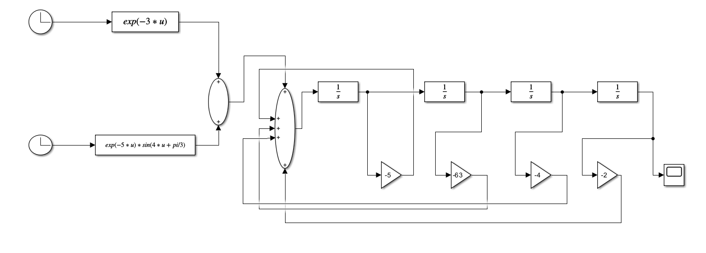
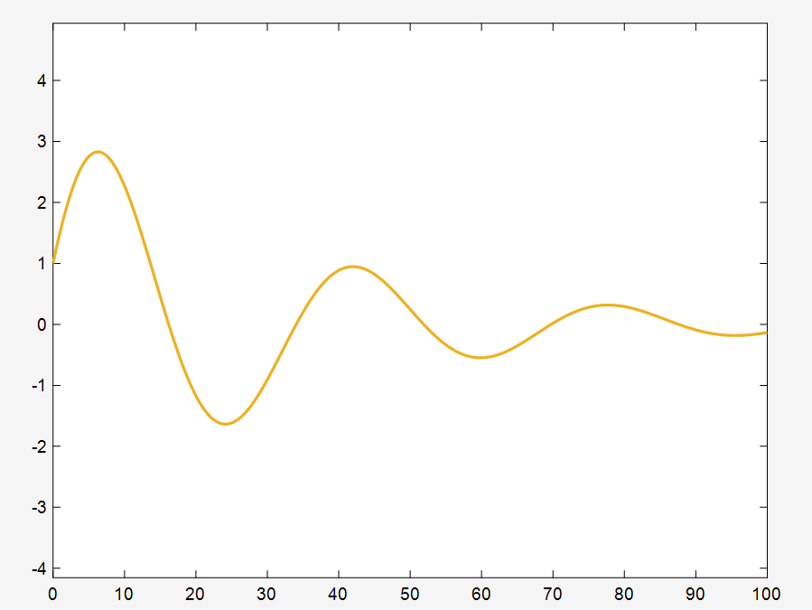

# 实验八：Simulink 仿真建模

## 实验目的

1. 掌握 Simulink 的编程式建模方法
2. 理解高阶微分方程的模拟结构图分解
3. 学会使用 Integrator 模块串联实现高阶系统
4. 掌握 MATLAB 脚本自动生成 Simulink 模型的技巧

## 微分方程

$$y^{(4)} + 5y''' + 63y'' + 4y' + 2y = e^{-3t} + e^{-5t}\sin(4t + \pi/3)$$

初始条件：$y(0)=1,\ y'(0)=0.5,\ y''(0)=0.5,\ y'''(0)=0.2$

## 建模思路

将四阶微分方程改写为最高阶导数的形式：

$$y^{(4)} = e^{-3t} + e^{-5t}\sin(4t+\pi/3) - 5y''' - 63y'' - 4y' - 2y$$

使用4个 `Integrator` 串联依次降阶，并通过 `Gain` 模块负反馈至输入端的 `Sum`。

## 实验内容

### simlink.m — 自动生成 Simulink 模型

使用 MATLAB 脚本编程式创建 Simulink 模型，包括：

- 2个 `Clock` + `Fcn` 生成激励信号
- `Sum` 加法器实现方程右端求和
- 4个 `Integrator` 串联实现降阶
- 4个 `Gain` 模块实现负反馈系数
- `Scope` 显示输出波形

**源程序：**
```matlab
%% 自动生成四阶微分方程Simulink仿真模型
model = 'FourOrderODE_Simulation';
new_system(model);
open_system(model);

%% 添加激励信号源
add_block('simulink/Sources/Clock', [model '/Clock1']);
add_block('simulink/Sources/Clock', [model '/Clock2']);
add_block('simulink/User-Defined Functions/Fcn', [model '/Fcn']);
set_param([model '/Fcn'], 'Expression', 'exp(-3*u)');
add_block('simulink/User-Defined Functions/Fcn', [model '/Fcn1']);
set_param([model '/Fcn1'], 'Expression', 'exp(-5*u)*sin(4*u+pi/3)');

%% 加法器求和
add_block('simulink/Math Operations/Sum', [model '/Sum1']);
set_param([model '/Sum1'], 'Inputs', '++');
add_block('simulink/Math Operations/Sum', [model '/Sum']);
set_param([model '/Sum'], 'Inputs', '+++++');

%% 4个Integrator串联
integratorNames = {'Integrator', 'Integrator1', 'Integrator2', 'Integrator3'};
initialConditions = [0.2, 0.5, 0.5, 1];  % y''' y'' y' y
for i = 1:4
    add_block('simulink/Continuous/Integrator', [model '/' integratorNames{i}]);
    set_param([model '/' integratorNames{i}], ...
        'InitialCondition', num2str(initialConditions(i)));
end

%% 负反馈Gain模块
gainValues = [-2, -4, -63, -5];  % 对应 y, y', y'', y''' 的系数
for i = 1:4
    add_block('simulink/Math Operations/Gain', [model '/Gain' num2str(i-1)]);
    set_param([model '/Gain' num2str(i-1)], 'Gain', num2str(gainValues(i)));
end

%% 连接信号线
% 信号源 → Fcn → Sum1 → Sum
add_line(model, 'Clock1/1', 'Fcn/1');
add_line(model, 'Clock2/1', 'Fcn1/1');
add_line(model, 'Fcn/1', 'Sum1/1');
add_line(model, 'Fcn1/1', 'Sum1/2');
add_line(model, 'Sum1/1', 'Sum/1');

% Integrator 串联
add_line(model, 'Sum/1', 'Integrator/1');
for i = 1:3
    add_line(model, [integratorNames{i} '/1'], [integratorNames{i+1} '/1']);
end

% 负反馈连线
add_line(model, 'Integrator/1', 'Gain3/1');
add_line(model, 'Gain3/1', 'Sum/2');
add_line(model, 'Integrator1/1', 'Gain2/1');
add_line(model, 'Gain2/1', 'Sum/3');
add_line(model, 'Integrator2/1', 'Gain1/1');
add_line(model, 'Gain1/1', 'Sum/4');
add_line(model, 'Integrator3/1', 'Gain/1');
add_line(model, 'Gain/1', 'Sum/5');

%% 添加Scope并运行仿真
add_block('simulink/Sinks/Scope', [model '/Scope']);
add_line(model, 'Integrator3/1', 'Scope/1');
set_param(model, 'Solver', 'ode45', 'StopTime', '100', 'MaxStep', '0.1');
sim(model);
```

## 模型结构图



## 运行结果



## 文件说明

| 文件 | 描述 |
|--------|------|
| `simlink.m` | MATLAB脚本，自动生成并运行 Simulink 模型 |
| `FourOrderODE_Simulation.slx` | 生成的 Simulink 模型文件 |
| `res/` | 模型结构图与仿真结果截图 |

## 使用方法

```matlab
cd 实验8
simlink    % 自动创建模型并运行仿真
```

运行后 `Scope` 窗口会自动打开，显示输出 $y(t)$ 的波形。

## 关键知识点

1. **编程式建模**: 使用 `add_block`、`set_param`、`add_line` 在脚本中构建 Simulink 模型
2. **高阶微分方程降阶**: 将 $n$ 阶方程转化为 $n$ 个 Integrator 串联的形式
3. **初始条件设置**: 每个 Integrator 的 `InitialCondition` 对应各阶导数初值
4. **负反馈实现**: Gain 模块设置为方程系数的负值，实现各项的移项
5. **信号源建模**: 使用 `Fcn` 模块 + `Clock` 实现任意输入函数
