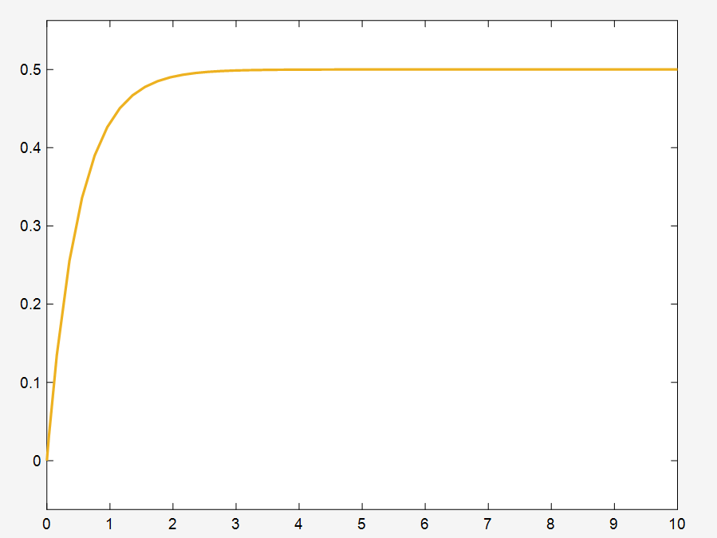

# 实验九：S-Function 编写与应用

## 实验目的

1. 理解 S-Function 的基本结构和工作原理
2. 掌握 Level-1 MATLAB S-Function 的编写方法
3. 学会在 Simulink 中集成自定义 S-Function 模块
4. 理解连续状态微分方程在 S-Function 中的实现方式

## 系统模型

S-Function 实现的一阶连续系统：

$$\dot{x} = -2x + u, \quad y = x$$

其中 $u$ 为输入信号，$x$ 为连续状态变量，$y$ 为输出。

## 实验内容

### myfirstsfcn.m — Level-1 MATLAB S-Function

编写一个自定义 S-Function，实现一阶连续系统 $\dot{x} = -2x + u$，并在 Simulink 中调用。

**S-Function 结构说明：**

| flag | 回调函数 | 作用 |
|------|---------|------|
| 0 | `mdlInitializeSizes` | 初始化：设置连续状态数、输出数、输入数等 |
| 1 | `mdlDerivatives` | 计算连续状态导数 $\dot{x} = f(t,x,u)$ |
| 2 | `mdlUpdate` | 更新离散状态（本例未使用） |
| 3 | `mdlOutputs` | 计算输出 $y = g(t,x,u)$ |
| 4 | `mdlGetTimeOfNextVarHit` | 计算下一采样时刻（本例未使用） |
| 9 | `mdlTerminate` | 仿真结束时的清理工作 |

**源程序：**
```matlab
function [sys,x0,str,ts] = myfirstsfcn(t,x,u,flag)

switch flag
    case 0
        [sys,x0,str,ts] = mdlInitializeSizes;
    case 1
        sys = mdlDerivatives(t,x,u);
    case 3
        sys = mdlOutputs(t,x,u);
    case {2,4,9}
        sys = [];
    otherwise
        error(['Unhandled flag = ',num2str(flag)]);
end

%=============================
function [sys,x0,str,ts] = mdlInitializeSizes

sizes = simsizes;
sizes.NumContStates  = 1;   % 1个连续状态
sizes.NumDiscStates  = 0;   % 0个离散状态
sizes.NumOutputs     = 1;   % 1个输出
sizes.NumInputs      = 1;   % 1个输入
sizes.DirFeedthrough = 0;   % 无直通
sizes.NumSampleTimes = 1;   % 1个采样时间

sys = simsizes(sizes);
x0  = 0;     % 初始状态
str = [];
ts  = [0 0]; % 连续采样时间

%=============================
function sys = mdlDerivatives(t,x,u)
% 连续状态方程: dx/dt = -2*x + u
sys = -2*x + u;

%=============================
function sys = mdlOutputs(t,x,u)
% 输出方程: y = x
sys = x;
```

## Simulink 模型

`exp_sfcn.slx` 中搭建了测试电路，使用 S-Function 模块调用 `myfirstsfcn`，配合信号源和 Scope 观察响应。

**运行结果：**



## 文件说明

| 文件 | 描述 |
|--------|------|
| `myfirstsfcn.m` | 自定义 Level-1 MATLAB S-Function 源文件 |
| `exp_sfcn.slx` | 调用 S-Function 的 Simulink 模型 |
| `res/` | 仿真结果截图 |

## 使用方法

1. 确保 `myfirstsfcn.m` 在 MATLAB 路径中
2. 打开 `exp_sfcn.slx`
3. 双击 S-Function 模块，确认 S-function name 为 `myfirstsfcn`
4. 运行仿真，在 Scope 中观察输出波形

```matlab
cd 实验9
open_system('exp_sfcn')
sim('exp_sfcn')
```

## 关键知识点

1. **S-Function 调度机制**: Simulink 通过 `flag` 参数在不同仿真阶段调用不同的回调函数
2. **初始化阶段 (flag=0)**: 设置状态数、输入输出数、采样时间等模型属性
3. **导数计算 (flag=1)**: 实现连续状态方程 $\dot{x} = f(t,x,u)$
4. **输出计算 (flag=3)**: 实现输出方程 $y = g(t,x,u)$
5. **直通标志 (DirFeedthrough)**: 当输出直接依赖于输入时设为 1，否则为 0
6. **采样时间 ts = [0 0]**: 表示连续系统，采样时间由求解器自动确定

## 实验总结

本实验是计算机仿真课程的最后一个实验，通过编写自定义 S-Function，深入理解了 Simulink 的仿真引擎工作原理。S-Function 是 Simulink 中最灵活的建模方式，可以描述任意复杂的动态系统行为，为后续高级仿真建模打下基础。