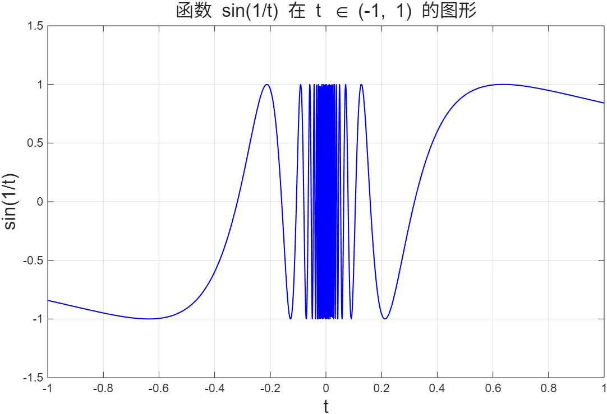
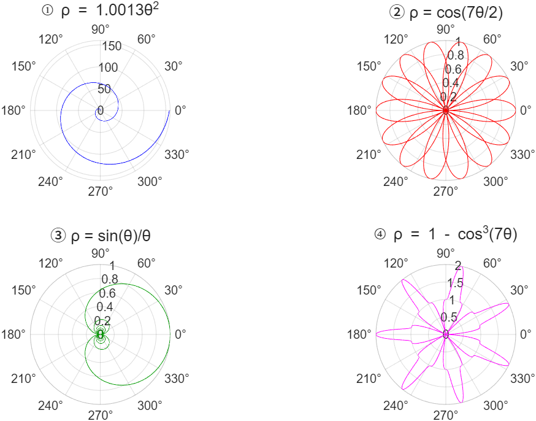
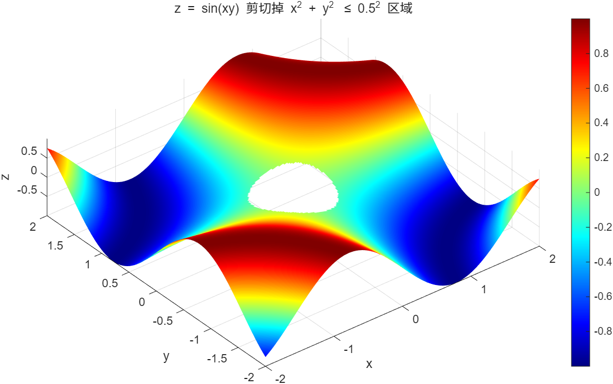

# 实验二：MATLAB 二维与三维图形绘制

## 实验目的

1. 掌握 MATLAB 的基本二维绘图方法
2. 学习极坐标图形的绘制
3. 掌握三维曲面图的多种可视化方式
4. 理解图形区域剪切技术

## 实验内容

### 1. 非均匀步距绘图 - sin(1/t) (main01.m)

使用对数间隔的非均匀步距绘制 sin(1/t) 函数，解决 t=0 处的高频振荡问题。

**源程序：**
```matlab
% 使用非均匀步距绘制 sin(1/t)
% 在0附近使用非常小的步长（对数间隔），远离0处使用较大步长
t_neg = -logspace(0, -4, 1000); % 负半轴，从-1到接近0
t_pos = logspace(-4, 0, 1000);  % 正半轴，从接近0到1
t = [t_neg, t_pos]; % 合并
y = sin(1./t);

figure;
plot(t, y, 'b-', 'LineWidth', 1);
xlabel('t');
ylabel('sin(1/t)');
title('函数 sin(1/t) 在 t \in (-1, 1) 的图形');
grid on;
xlim([-1, 1]);
ylim([-1.5, 1.5]);
```

**运行结果：**



---

### 2. 极坐标图形绘制 (main02.m)

绘制四种典型的极坐标函数，展示不同类型的极坐标曲线。

**源程序：**
```matlab
% 定义不同的theta范围
theta1 = linspace(0, 4*pi, 2000);
theta2 = linspace(0, 8*pi, 4000);
theta3 = linspace(-20, 20, 4000);
theta4 = linspace(0, 2*pi, 2000);

% 计算对应的rho值
rho1 = 1.0013 * theta1.^2;          % 螺旋线
rho2 = cos(7*theta2/2);              % 玫瑰线
rho3 = sin(theta3)./theta3;          % sinc函数
rho3(theta3 == 0) = 1;               % 处理theta=0处的奇点
rho4 = 1 - cos(7*theta4).^3;        % 周期函数

% 绘制四个极坐标子图
figure;
subplot(2,2,1);
polarplot(theta1, rho1, 'b');
title('① ρ = 1.0013θ^2');

subplot(2,2,2);
polarplot(theta2, rho2, 'r');
title('② ρ = cos(7θ/2)');

subplot(2,2,3);
polarplot(theta3, rho3, 'Color', [0 0.6 0]);
title('③ ρ = sin(θ)/θ');

subplot(2,2,4);
polarplot(theta4, rho4, 'm');
title('④ ρ = 1 - cos^3(7θ)');
```

**运行结果：**



---

### 3. 多方式三维曲面图绘制 (main03.m)

对四个二元函数分别使用 `surf`、`surfc`、`mesh`、等高线、俯视图、主视图共6种方式可视化。

**源程序：**
```matlab
% 定义公共网格范围
x = linspace(-2, 2, 50);
y = linspace(-2, 2, 50);
[X, Y] = meshgrid(x, y);

% 定义四个函数
Z1 = X .* Y;
Z2 = sin(X .* Y);
Z3 = sin(X.^2 - Y.^2);
Z4 = -X .* Y .* exp(-2*(X.^2 + Y.^2));

% 为每个函数创建一个图形窗口，展示多种视图
functions = {Z1, Z2, Z3, Z4};
titles = {'f(x,y) = xy', 'f(x,y) = sin(xy)', ...
    'f(x,y) = sin(x^2-y^2)', 'f(x,y) = -xye^{-2(x^2+y^2)}'};

for k = 1:4
    Z = functions{k};
    figure('Name', titles{k}, 'NumberTitle', 'off');

    % 子图1: surf() 三维曲面图
    subplot(2,3,1);
    surf(X, Y, Z);
    title('surf() 曲面');
    xlabel('x'); ylabel('y'); zlabel('z');
    shading interp;

    % 子图2: surfc() 带等高线的曲面图
    subplot(2,3,2);
    surfc(X, Y, Z);
    title('surfc() 带等高线');
    xlabel('x'); ylabel('y'); zlabel('z');

    % 子图3: mesh() 网格图
    subplot(2,3,3);
    mesh(X, Y, Z);
    title('mesh() 网格');
    xlabel('x'); ylabel('y'); zlabel('z');

    % 子图4: 等高线图
    subplot(2,3,4);
    contourf(X, Y, Z, 20);
    colorbar;
    title('等高线图');
    xlabel('x'); ylabel('y');
    axis square;

    % 子图5: 俯视图
    subplot(2,3,5);
    surf(X, Y, Z);
    view(0, 90);
    shading interp;
    title('俯视图');
    xlabel('x'); ylabel('y');
    colorbar;

    % 子图6: 主视图
    subplot(2,3,6);
    surf(X, Y, Z);
    view(0, 0);
    shading interp;
    title('主视图');
    xlabel('x'); zlabel('z');
end
```

**运行结果（以 f(x,y)=sin(xy) 为例）：**

 = sin(xy).png)

> **注**: 程序会为4个函数各生成一个包含6种子图的图形窗口

---

### 4. 曲面剪切 (main04.m)

演示如何将三维曲面中的圆形区域"挖空"（设为 NaN），实现区域裁剪效果。

**源程序：**
```matlab
% 创建网格
x = linspace(-2, 2, 200);
y = linspace(-2, 2, 200);
[X, Y] = meshgrid(x, y);

% 计算完整的 z = sin(x*y)
Z = sin(X .* Y);

% 将圆形区域 x^2 + y^2 <= 0.5^2 内的点设为 NaN（剪切掉）
mask = (X.^2 + Y.^2) <= 0.5^2;
Z(mask) = NaN;

% 绘制剪切后的表面图
figure;
surf(X, Y, Z);
shading interp;
xlabel('x');
ylabel('y');
zlabel('z');
title('z = sin(xy) 剪切掉 x^2 + y^2 \leq 0.5^2 区域');
colormap('jet');
colorbar;
axis tight;
view(-30, 30);
```

**运行结果：**



## 文件说明

| 文件名 | 描述 |
|--------|------|
| `main01.m` | sin(1/t) 非均匀步距绘图 |
| `main02.m` | 四种极坐标曲线绘制 |
| `main03.m` | 四函数六视图三维曲面图 |
| `main04.m` | 圆形区域曲面剪切 |
| `res/` | 实验结果截图 |
| `实验二.doc` | 实验报告模板 |

## 使用方法

在 MATLAB 中依次运行：
```matlab
main01   % sin(1/t) 图形
main02   % 极坐标图形
main03   % 三维曲面图（生成4个窗口）
main04   % 曲面剪切
```

## 关键知识点

1. **非均匀采样**: 使用 `logspace` 对数间隔处理高频振荡区域
2. **极坐标绘图**: `polarplot` 函数的使用及参数设置
3. **三维可视化**: `surf`、`surfc`、`mesh`、`contourf` 等绘图函数对比
4. **视角控制**: `view()` 函数实现俯视、主视等多角度观察
5. **图形裁剪**: 利用 NaN 值实现曲面的区域剪切
6. **网格生成**: `meshgrid` 创建二维计算网格
