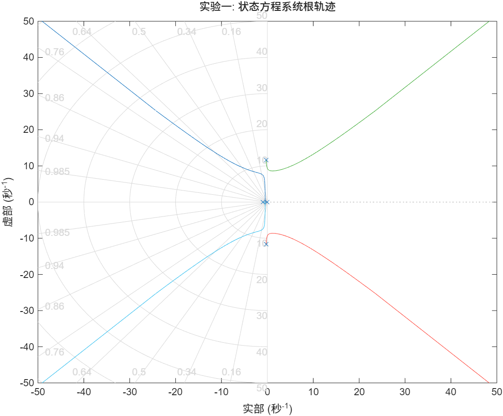
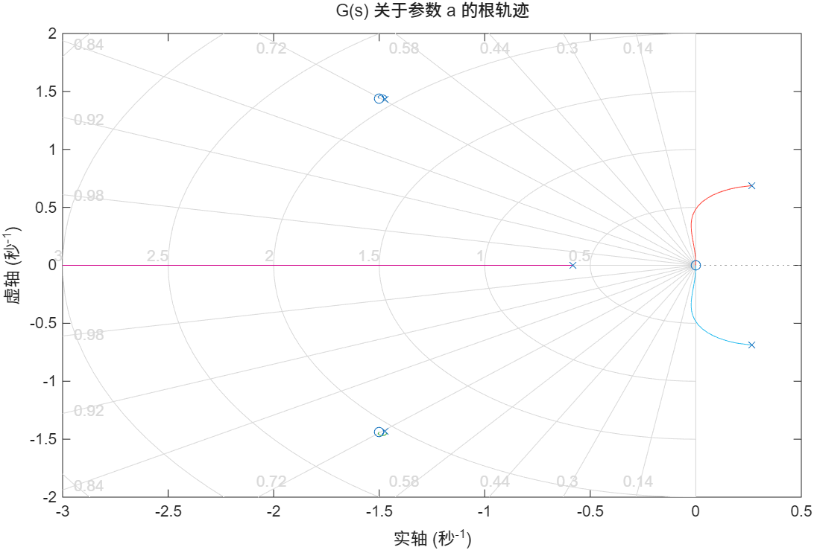
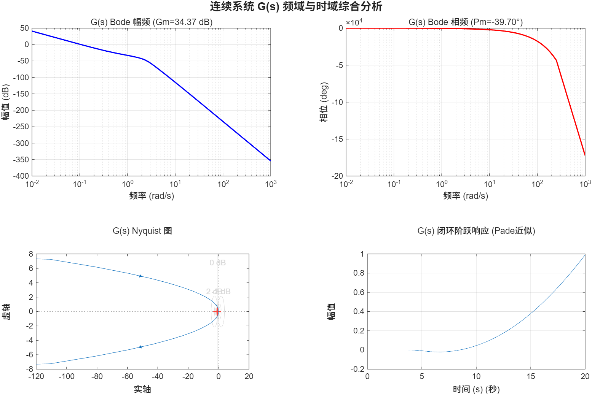

# 实验六：根轨迹与频域分析

本实验包含三个 MATLAB 脚本，分别完成状态方程系统的根轨迹分析、参数根轨迹分析，以及带纯延迟系统的频域稳定性分析。

## 文件说明

| 文件 | 内容 |
|------|------|
| `main01.m` | 状态方程系统根轨迹与稳定性分析 |
| `main02.m` | 关于参数 a 的根轨迹分析 |
| `main03.m` | 带延迟连续/离散系统的频域分析 |
| `res/` | 运行结果截图 |

## 实验内容

### main01：状态方程系统根轨迹

- 给定 4 阶状态空间矩阵 (A, B, C, D)，转换为传递函数
- 绘制根轨迹图，数值搜索使闭环系统稳定的增益 K 范围
- 选取稳定 K 值验证闭环阶跃响应

### main02：关于参数 a 的根轨迹

- 开环传递函数含可变参数 a，改写特征方程为 `P(s) + a·Q(s) = 0` 形式
- 构造等效传递函数 `G_eq = Q/P`，绘制关于 a 的根轨迹
- 数值搜索稳定区间，并用不同 a 值的阶跃响应验证

### main03：带延迟系统的频域分析

**连续系统 G(s)：**
- 含纯延迟 e^(-3s) 的高阶开环传递函数
- 10 阶 Pade 近似处理延迟环节
- 计算增益裕度、相位裕度，绘制 Bode 图与 Nyquist 图
- 闭环稳定性判定与阶跃响应

**离散系统 H(z)：**
- 含 z^(-5) 延迟的离散传递函数
- 计算离散域增益裕度与相位裕度
- 绘制 Bode 图、Nyquist 图与闭环阶跃响应

## 运行环境

- MATLAB R2023a+
- 需要工具箱：Control System Toolbox

## 运行方式

```matlab
cd 实验六
main01   % 根轨迹与稳定K范围
main02   % 参数a的根轨迹
main03   % 带延迟系统的频域分析
```

## 结果示例

| 根轨迹 | 阶跃响应 |
|--------|----------|
|  |  |
|  |  |
